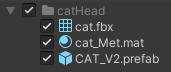
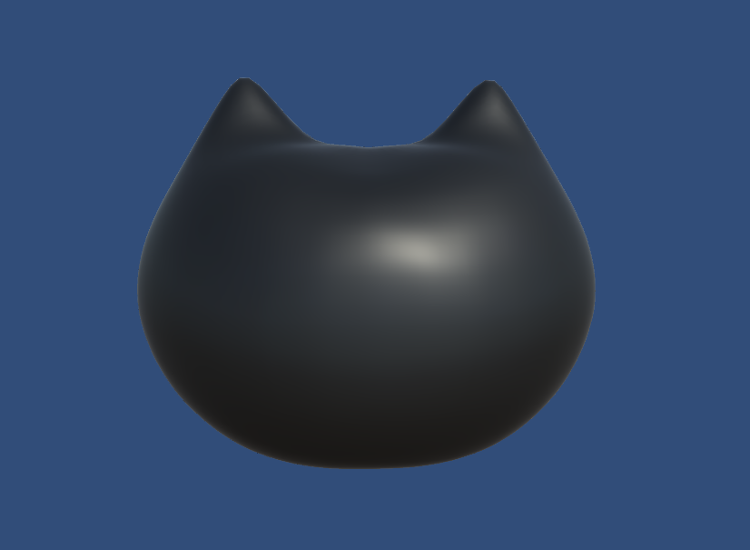

# Project Overview
This project was created as a practice work.
This project includes 3D models created using **Blender** and converted for use in **Unity**.

## 📌 File Structure
- **catImag.png**: Image related to the project
- **.unitypackage**: Package file converted for use in Unity

## 🖼️ Preview

## 🛠️ Creation Process
1. **Modeling**: 3D model creation in Blender
2. **Export**: Conversion to a Unity-compatible format
3. **Unity Implementation**: Testing and optimization in Unity

## 📜 License
This project is distributed under the **Creative Commons Zero v1.0 Universal (CC0 1.0)** license.  
This means anyone can freely use, modify, and distribute it without requiring permission, including for commercial purposes.

## 👤 Creator
Created by **dohnn-0203**.

---
📢 For project-related inquiries, please leave a message on (dohnn0203@gmail.com).
